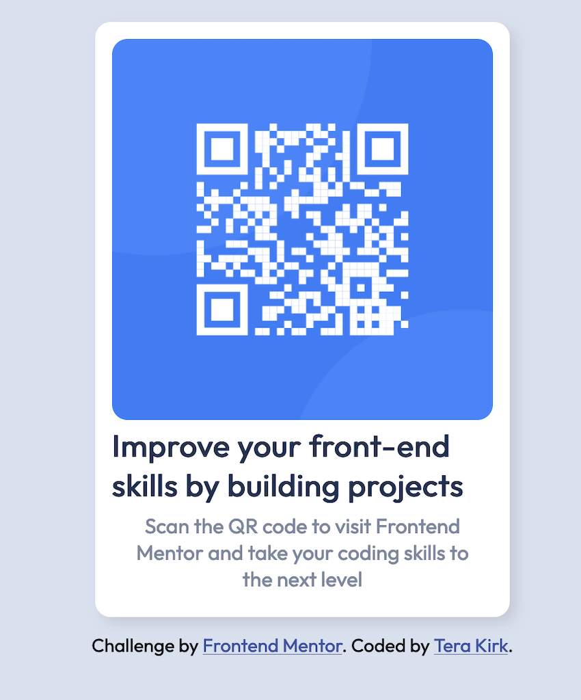

# Frontend Mentor - QR code component solution

This is a solution to the [QR code component challenge on Frontend Mentor](https://www.frontendmentor.io/challenges/qr-code-component-iux_sIO_H). Frontend Mentor challenges help you improve your coding skills by building realistic projects. 

## Table of contents

- [Overview](#overview)
  - [Screenshot](#screenshot)
  - [Links](#links)
- [My process](#my-process)
  - [Built with](#built-with)
  - [What I learned](#what-i-learned)
  - [Continued development](#continued-development)
  - [Useful resources](#useful-resources)
- [Author](#author)
- [Acknowledgments](#acknowledgments)

## Overview

This is a QR code. It took me a while, but I'm proud of all I've learned.

### Screenshot

### Links

- Solution URL: [Add solution URL here](https://your-solution-url.com)
- Live Site URL: [Add live site URL here](https://your-live-site-url.com)

### Built with

- Semantic HTML5 markup
- Flexbox

### What I learned

This project helped me to practice Flexbox and using REM rather than pixels for accessiblity. I also learned I should slow down and pay attention to the style guide. ("Why doesn't this paragraph look right?" Because I haven't used the color the style guide told me to!)

### Continued development

Doing this project made me more confident using Flexbox, and I hope to continue practicing it (and CSS Grid.)

**Note: Delete this note and the content within this section and replace with your own plans for continued development.**

### Useful resources

- [Keep the Footer at the Bottom: Flexbox vs. Grid](https://moderncss.dev/keep-the-footer-at-the-bottom-flexbox-vs-grid/) by Stephanie Eckles - I had trouble getting the footer with the attribution to stay underneath the QR code, and this gave me a solution.
- [FLEX](https://flexbox.malven.co/) - This Flexbox cheat sheet helped me see Flexbox concepts in action. (Applying properties to a parent so the children will be affected is kind of counter-intuitive.)

## Author

- Website - [Sweet Perdition](http://www.sweet-perdition.net)
- Frontend Mentor - [@terakrk](https://www.frontendmentor.io/profile/terakrk)

## Acknowledgments

Thanks to code from Antares (https://github.com/xdcron/-Calebs-code), Nyxx (https://github.com/InfiniteEndeavours/frontend-mentor-challenge-1) and Ronan-cn (https://github.com/Ronan-cn/projeto-qr-code-frontendmentor/tree/main). Thanks also to GraceSnow and AlexKMarshall.

